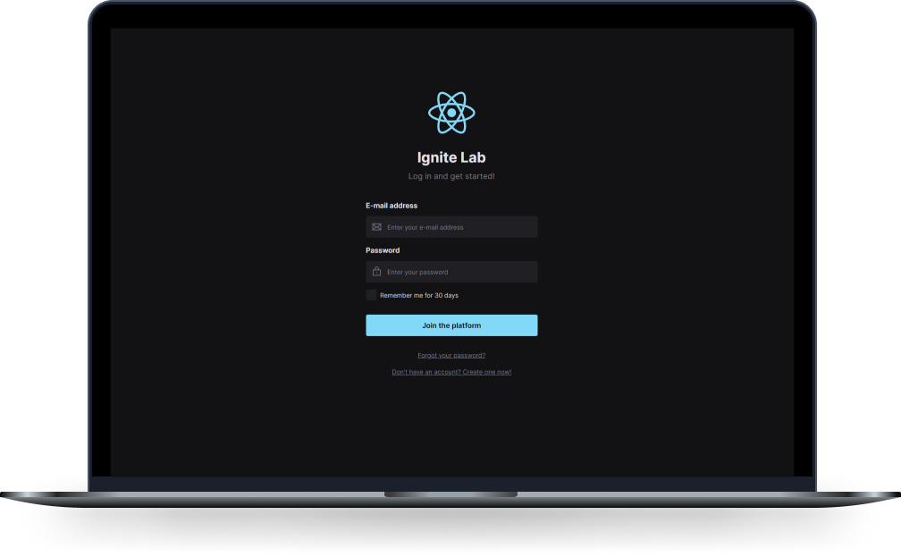

<h1 align="center">
  
</h1>

  <a href="#-technologies">Technologies</a>&nbsp;&nbsp;&nbsp;|&nbsp;&nbsp;&nbsp;
  <a href="#-project">Project</a>&nbsp;&nbsp;&nbsp;|&nbsp;&nbsp;&nbsp;
  <a href="#-how-to-run">How to run</a>

  

 

## ✨ Technologies

This project was developed with the following technologies:

- [React](https://reactjs.org)
- [Vite](https://vitejs.dev/)
- [TypeScript](https://www.typescriptlang.org/)
- [Tailwind](https://tailwindcss.com)
- [Storybook](https://storybook.js.org)
- [Radix UI](https://radix-ui.com)

## 💻 Project

This project was made from Rocketseat in Ignite Lab 03. All credits to them. 🎉

## 🚀 How to run

- Clone the repository
- Install dependencies with `npm install`
- Start the project with `npm run dev`
- Start the storybook with `npm run storybook`
